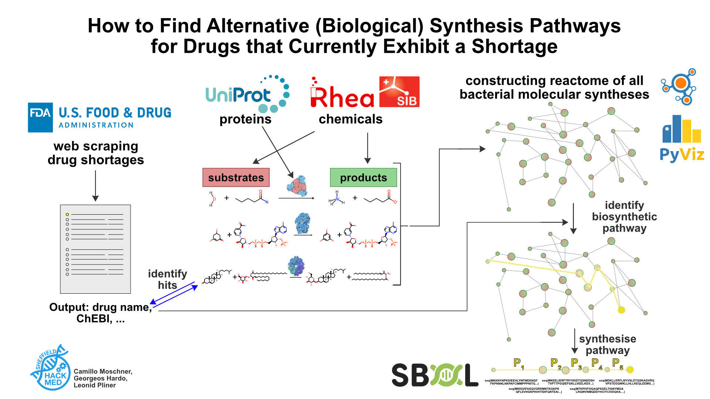

# reac2drug
 DEVPOST: https://devpost.com/software/biological-production-of-drugs-on-the-fda-shortage-list?ref_content=user-portfolio&ref_feature=in_progress

## Inspiration

Medicines save lives every day. However, the supply of many essential medicines is not always guaranteed and many have recently been added to the FDA drug shortage list. This is, in part, due to COVID related use, stockpiling and supply chain shortages. [1,2] We combine knowledge of Synthetic and Systems Biology with big data analysis to identify alternative production routes of these life-changing drugs.

## What it does

We scrape information from the FDA's drug shortage database, correlate it with chemical identifiers, download the full protein reactome of all bacterial species, and combine this with network theory to find 'hits' of drugs in short supply that are produced by the protein reactome. Finally, we use our protein reactome graph to find the most efficient way to synthesise our hits. 

Ultimately, our pipeline outputs a list of gene sequences which can be cloned into a plasmid for synthetic bioproduction. Because we only focus on the bacterial metabolome, we ensure that most, if not all of the enzymes used can be reconstituted into commonly-used biotechnology organisms. 

## How we built it

Code used:
- HackMed21_0_helper.py
- HackMed21_a_FDAdrugshortage_scraper.ipynb
- HackMed21_b_UniProt_BacProtExplorer.ipynb
- HackMed21_c_RheaConnectorDF.ipynb
- HackMed21_d_Graph_Generation.ipynb
- HackMed21_e_Path_Finding.ipynb

## Challenges we ran into

- [x] Web scraping pages with inconsistent information and multiple namings with similar ids.
- [x] Creating complete dataset of all chemical reactions of the known biochemical reactions on the planet
- [x] Creating dataset combining information from multiple public bio-databases to correlate medicines on the FDA drug shortage list with their chemical structure identifiers and the proteins/enzymes they react with 

## Accomplishments that we're proud of

- web scraping dynamically changing page of real live-saving drugs
- big data analysis of multiple biological databases (UniProt, Rhea)
- constructing a single [graph network that integrates ALL metabolic reactions](https://www.youtube.com/watch?v=Yb2m7YIlaUQ YouTube) that exist on earth (to humanity's current understanding) and creating an [interactive version](https://www.youtube.com/watch?v=ohe6U7dFNUE) of it
- regex (because it's magic)
- identification of metabolic pathways that actually produce a medicine found on the FDA's drug shortage list inside this holistic reactome network
- We **successfully identified biosynthetic pathways for 4 medicines on FDA's drug shortage list.**
- Using progesterone biosynthesis as a case study we identified the 'best', shortest path to synthesise progesterone from glucose in just four chemical conversion steps (see image above).

## What we learned

- Even though we live in the 21st century, **many of our most essential drugs often exhibit shortages**. Our web scraper **identified 161 medicines** that the US FDA currently lists inside its [Drug Shortage List](https://www.accessdata.fda.gov/scripts/drugshortages/default.cfm). These include well-known drugs such as the immuno-suppressant cortisone and the pain-killer Fentanyl. The high number of standard, old drugs on this list indicates a systemic production problem that we want to find a solution for.
- There are ~**27,000 biochemical reactions** known to human kind (Rhea database).
- We **discovered a new biosynthetic pathway for the production of progesterone**, a medicine exhibiting a shortage.

Fun trivia:
- There is chemical simply called "[A](https://www.ebi.ac.uk/chebi/searchId.do?chebiId=CHEBI:13193)"
- The data is sloppy... several enzymes are noted to don't do anything in their reaction annotation.

## What's next for Biological Production of Drugs on the FDA Shortage List

(1) **Scraper Optimisation**: In future implementations, we would like to optimise our FDA web scraper to be able to handle more medicine names and keep it running for multiple months to years to analyse how drug shortages change over time and ideally train a Machine Learning algorithm for simple prediction of shortages before they occur. This could inform drug manufacturers and mitigate or even prevent a given drug's shortage in the first place.

(2) **User Testing**: Our coding pipeline ultimately gives synthetic biologists and biochemists a guide of how to produce important drugs inside cells. As such it is important to ensure that user friendliness for biologists and plan user tests with both computational and experimental biologists to identify how to make the pipeline easier to implement in the field.

(3) **Unnatural Biosynthetic Pathways**: Our current pipeline looks for biosynthetic pathways for the medicines one the FDA drug shortage list that naturally occur. We find it remarkable that we found as many hits as we did. However, in the future we might want to create medicines for which no natural biosynthetic pathway is yet known (e.g. most plant-based drugs) or no natural biosynthetic pathway actually exist (e.g. chemically synthesised drugs). For these instances, we plan to use a chemical similarity search of the drug we want to produce to identify enzymes that have similar products to our drug. We then create code to identify the enzyme's active site, telling us which residues on the enzyme have a high probability of changing the enzyme's function to our desired behaviour. Using this information, our experimental biologists can then perform directed protein evolution to convert the enzyme to produce our drug of interest. 

- [1] [Duffin 2020, An activist history of drug shortages and its silos](https://www.thelancet.com/journals/lancet/article/PIIS0140-6736(20)31876-6/fulltext)
- [2] [WHO Drug Information Vol. 30, No. 2, 2016: Medicines shortages Global approaches to addressing shortages of essential medicines in health systems](https://www.who.int/medicines/publications/druginformation/WHO_DI_30-2_Medicines.pdf?ua=1)
